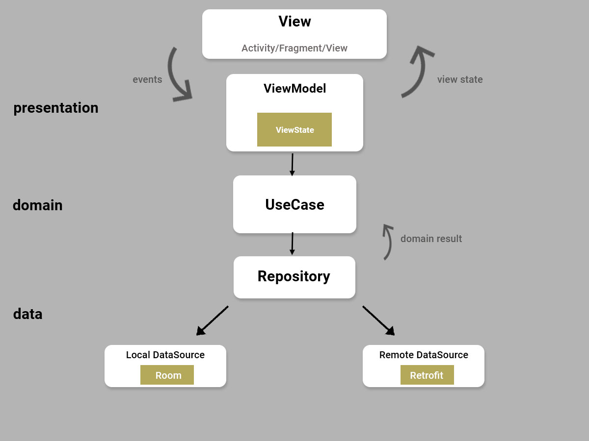
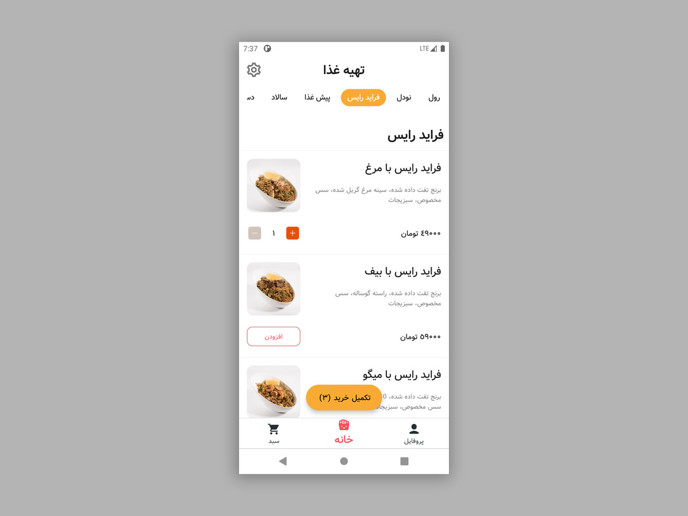
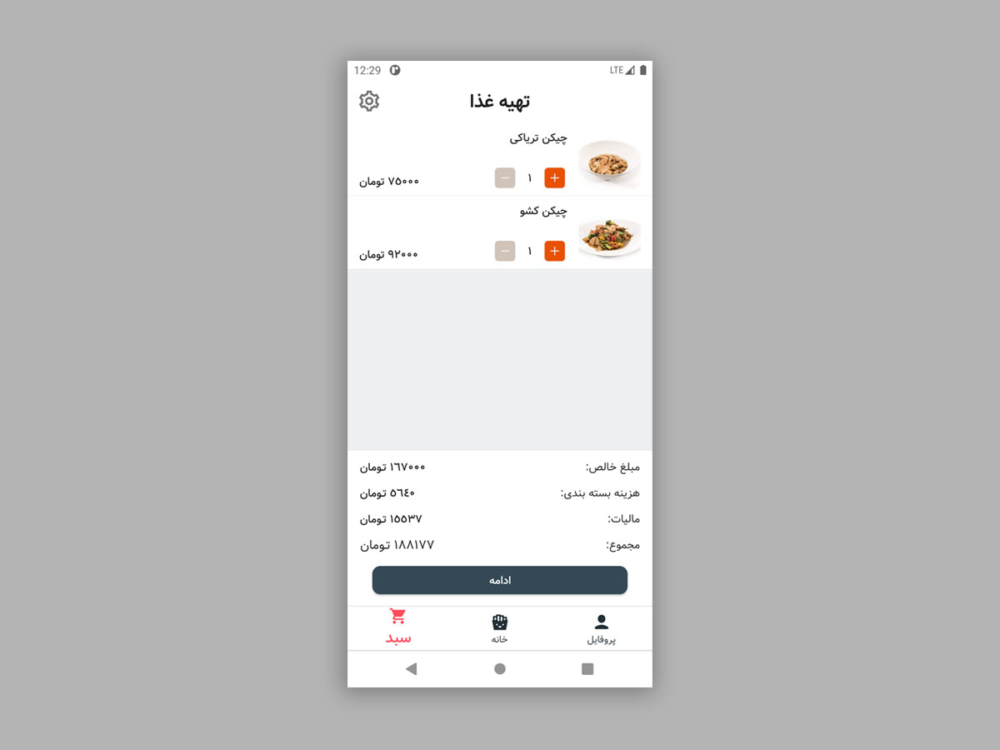

# clean_mvvm_delivery
 

- Modularization
- Gradle written in Kotlin DSL
- [Coroutines](https://developer.android.com/kotlin/coroutines) and flows
- [Room Persistence Library](https://developer.android.com/training/data-storage/room "Room Persistence Library")
- Dependency Injection with [Koin](https://github.com/InsertKoinIO/koin "Koin") Library.
- Model View Intent Architecture - MVI.
- Clean Architecture approach.

# برای دوستان فارسی زبان
- [مقاله ویرگول](https://vrgl.ir/OBqZV)

## Architecture

The Application consist of three layer:
- Presentation
- Domain
- Data

||
|:----:|

## **Screen shot:** 
screen for select Food and cart list

||| 
|:----:|:----:|
